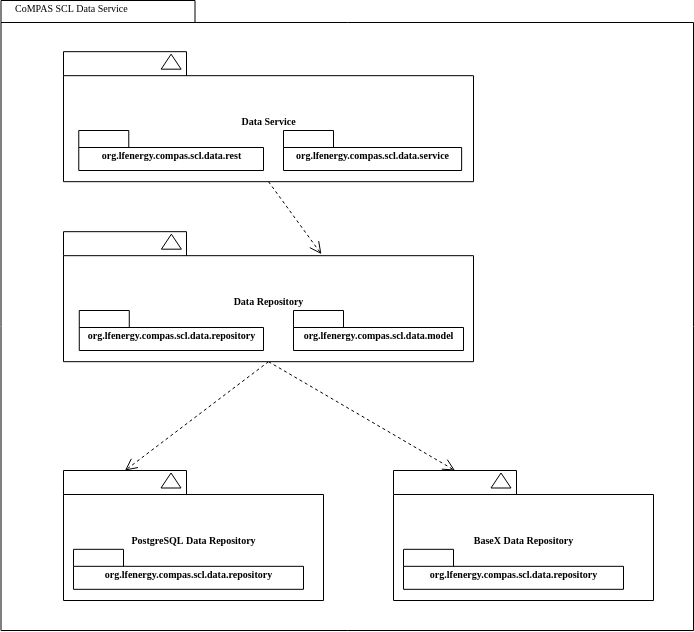
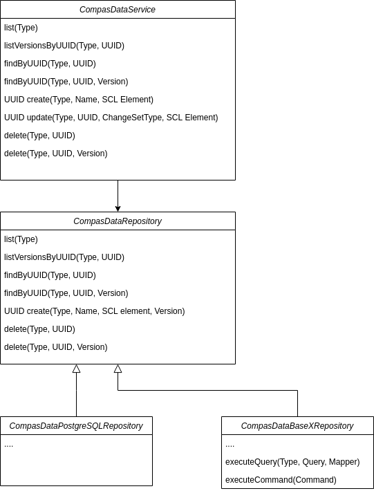
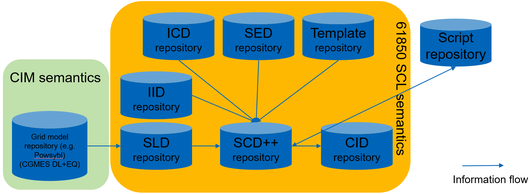

<!--
SPDX-FileCopyrightText: 2021 Alliander N.V.

SPDX-License-Identifier: CC-BY-4.0
-->

## CoMPAS SCL Data Service

### Introduction

The CoMPAS SCL Data Service is a REST interface that can be used to retrieve, store, update and delete SCL Configuration
to different kind of database.

### Components

The Service consists of a generic service layer with a REST interface on top. And a repository layer will be used to
communicate with the storage. There will be different implementations available of this repository layer.

### REST interface

The request and response bodies of the REST calls use the format XML as content (not JSON), because the SCL is also
written in XML. Because the SCL Data Service needs to support the different versions of the SCL Schema no validation is
done. For this a separate component will be build to validate the XML. This is also the reason that the Create and
Update request bodies are searching for an SCL Element in the Body. This part will be the content of the SCL XML that is
stored.

Depending on the environment where the component is running there is an OpenAPI UI available on "
/openapi-ui/index.html" (for example "http://localhost:8080/openapi-ui/index.html"). The OpenAPI JSON can be retrieved
on "/openapi" (for example "http://localhost:8080/openapi").

### Services

There are some main class with their methods as shown below.

The CompasDataService Class is the generic part of the software. Then there are the repository classes. The
responsibility of the repository classes is to retrieve, store and delete entries from their storages. Nothing more than
that.

The Service class contains some logic regarding versions and private elements.

- list: Returns the ID and Latest version of all SCL found for a specific type of SCL.
- listVersionsByUUID: Returns all stored versions of a specific SCL found.
- findByUUID: Retrieve the latest version of an SCL with a UUID for a specific type of SCL. Or if the version is passed
  that specific version of an SCL.
- create: Stores a first version (1.0.0) of the SCL. Also adding the type and name as private elements to the SCL.
- update: Retrieve the latest version. Copy the private elements from that record. Add a historical record to the
  Header. Determine the new version, using the latest version and ChangeSetType. Depending on if we want to keep
  historical versions of the SCL.
    - Keep history: Add the new SCP to the storage with the new version.
    - No history: Update the existing SCP in the storage.
- delete: Remove (all versions) of the SCL from the storage. Or if the version is passed that specific version of the
  SCL.

### BaseX

There a some BaseX specific choices made in storing the SCL.

- For every type of SCL a separate database is created. This is quite easy done in BaseX.
  
- In these databases the SCL will be stored as "\<uuid\>/\<major-version\>/\<minor-version\>/\<patch-version\>/scl.xml".
  This way it will be easy to store the different version and find the latest version.

### PostgreSQL

TODO